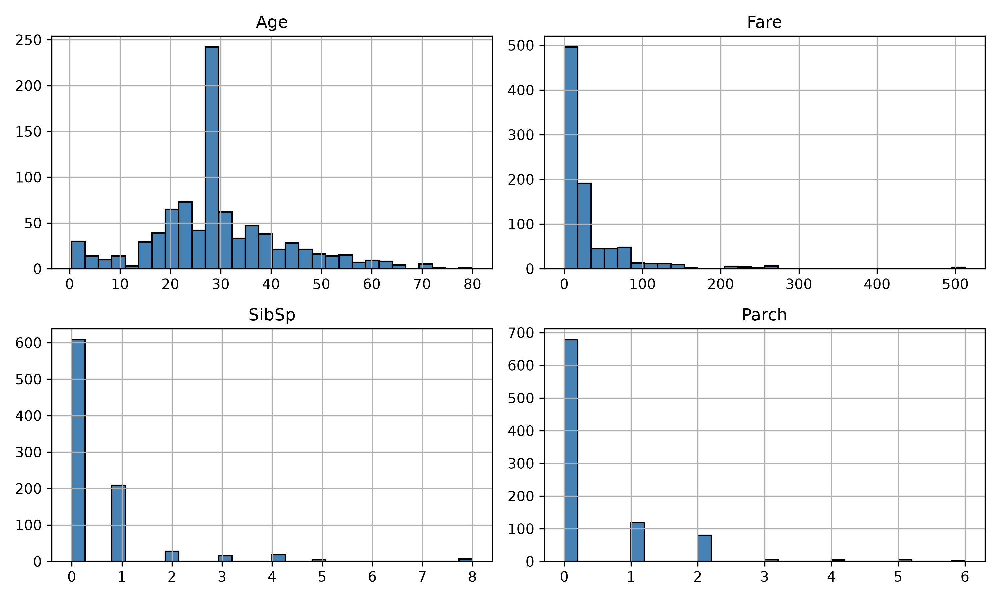

# Task 23: Create Histograms for Numerical Features

## Task Description
**What are we investigating?**  
How are numerical values distributed across Age, Fare, SibSp, and Parch?

## Code
```python
import pandas as pd
import matplotlib.pyplot as plt

df = pd.read_csv("Titanic-Dataset.csv")
df["Age"] = df["Age"].fillna(df["Age"].median())

numeric_cols = ["Age", "Fare", "SibSp", "Parch"]
df[numeric_cols].hist(
    bins=30,
    figsize=(10, 6),
    layout=(2, 2),
    color="steelblue",
    edgecolor="black"
)
plt.tight_layout()
plt.savefig("histograms_numerical.png", dpi=300)
plt.show()

```

## Output
```
Plot generated and saved successfully.
```

### Generated Visualization


## Observation
**What does the result tell us about the dataset?**  
`Fare` exhibits severe right skewness with most observations under $50. `Age` follows a bell curve centered around 28-30. Family features (`SibSp`, `Parch`) show that most passengers travelled alone.

## Student Questions & Answers
- **1. The general age distribution:**  
  Bell-shaped, centered between 20 and 35 years.
- **2. Whether Fare values are evenly distributed:**  
  No, heavily right-skewed; mostly clustered under $50.
- **3. Whether most passengers travelled with many or few family members:**  
  Most travelled with zero or very few family members.
- **4. Which numerical variable appears strongly skewed:**  
  `Fare` is severely right-skewed.
