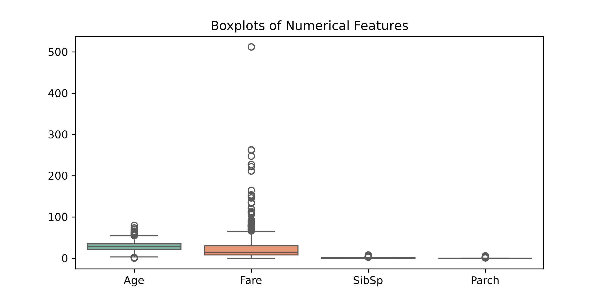

# Task 24: Detect Possible Outliers Using Boxplots

## Task Description
**What are we investigating?**  
Do numerical features contain unusually high or low values (outliers)?

## Code
```python
import pandas as pd
import matplotlib.pyplot as plt
import seaborn as sns

df = pd.read_csv("Titanic-Dataset.csv")
df["Age"] = df["Age"].fillna(df["Age"].median())
numeric_cols = ["Age", "Fare", "SibSp", "Parch"]

plt.figure(figsize=(8, 4))
sns.boxplot(data=df[numeric_cols], palette="Set2")
plt.title("Boxplots of Numerical Features")
plt.savefig("boxplots_numerical.png", dpi=300)
plt.show()

```

## Output
```
Plot generated and saved successfully.
```

### Generated Visualization


## Observation
**What does the result tell us about the dataset?**  
The boxplot reveals extreme outliers in `Fare`, where a few passengers paid over $500, far above the 75th percentile of $31.00.

## Student Questions & Answers
- **1. Which feature has the most obvious outliers?**  
  `Fare`.
- **2. Does Fare contain unusually high observations?**  
  Yes, multiple observations exceed $200, up to $512.33.
- **3. Does seeing an outlier automatically mean the value is incorrect?**  
  No. Outliers often reflect genuine real-world extremes, such as premier 1st class luxury suites.
