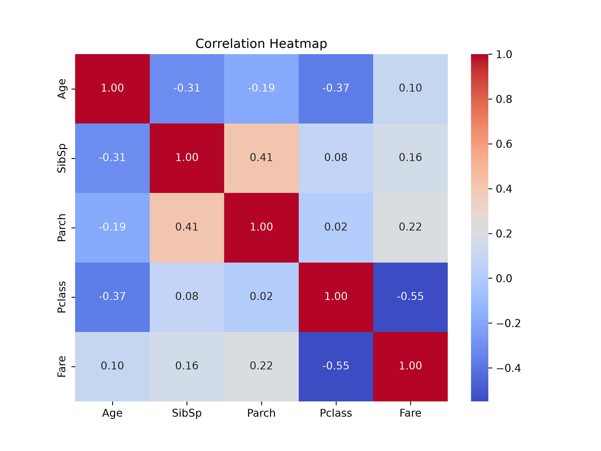

# Task 26: Display Correlation as a Heatmap

## Task Description
**What are we investigating?**  
How can we visually compare correlations between numerical variables?

## Code
```python
import pandas as pd
import matplotlib.pyplot as plt
import seaborn as sns

df = pd.read_csv("Titanic-Dataset.csv")
selected_cols = ["Age", "SibSp", "Parch", "Pclass", "Fare"]

plt.figure(figsize=(8, 6))
sns.heatmap(
    df[selected_cols].corr(),
    annot=True,
    cmap="coolwarm",
    fmt=".2f"
)
plt.title("Correlation Heatmap")
plt.savefig("correlation_heatmap.png", dpi=300)
plt.show()

```

## Output
```
Plot generated and saved successfully.
```

### Generated Visualization


## Observation
**What does the result tell us about the dataset?**  
The heatmap clearly illustrates positive covariance between family members (`SibSp` and `Parch`) and inverse relationship between ticket class and fare.

## Student Questions & Answers
- **1. Strongest positive correlation:**  
  `SibSp` and `Parch` (+0.41).
- **2. Variables with negative correlation:**  
  `Pclass` and `Fare` (-0.55), `Pclass` and `Age` (-0.34).
- **3. Relationship between Pclass and Fare:**  
  Strong negative correlation (-0.55); 1st class (numeric 1) paid far higher fares than 3rd class (numeric 3).
- **4. Does correlation prove causation?**  
  No, correlation measures association, not causality.
