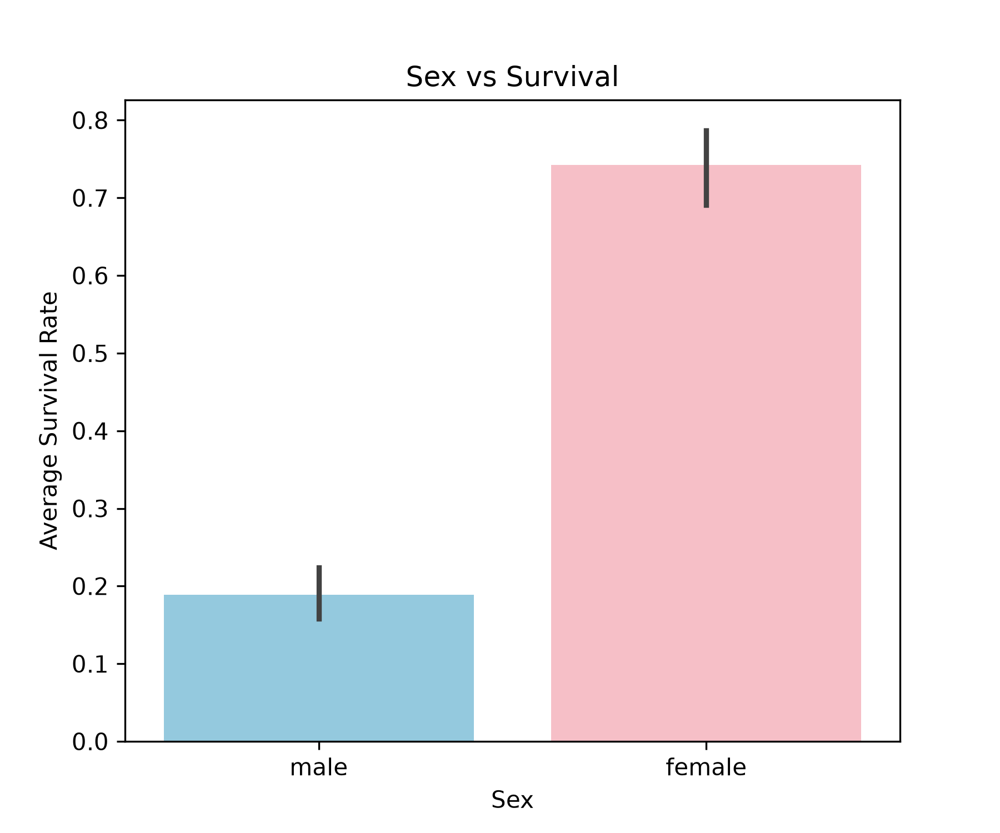

# Task 27: Compare Survival by Sex Using a Bar Plot

## Task Description
**What are we investigating?**  
Can we visually compare male and female survival rates?

## Code
```python
import pandas as pd
import matplotlib.pyplot as plt
import seaborn as sns

df = pd.read_csv("Titanic-Dataset.csv")

plt.figure(figsize=(6, 5))
sns.barplot(
    x="Sex",
    y="Survived",
    data=df,
    hue="Sex",
    legend=False,
    palette=["skyblue", "lightpink"]
)
plt.title("Sex vs Survival")
plt.xlabel("Sex")
plt.ylabel("Average Survival Rate")
plt.savefig("survival_by_sex.png", dpi=300)
plt.show()

```

## Output
```
Plot generated and saved successfully.
```

### Generated Visualization


## Observation
**What does the result tell us about the dataset?**  
The bar plot dramatically highlights the gender gap in survival (74.20% female vs 18.89% male).

## Student Questions & Answers
- **Conclusion about sex and passenger survival:**  
  Female passengers had a significantly higher survival rate (~74.20%) compared to male passengers (~18.89%). This stark difference was caused by the strict enforcement of the 'women and children first' evacuation protocol during lifeboat boarding.
