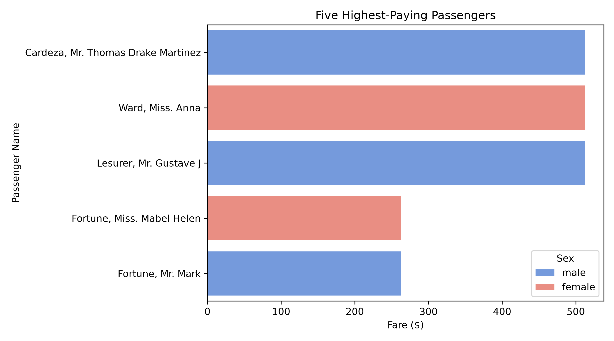

# Task 29: Visualize the Five Highest-Paying Passengers

## Task Description
**What are we investigating?**  
How can we visually compare the fares of the five highest-paying passengers?

## Code
```python
import pandas as pd
import matplotlib.pyplot as plt
import seaborn as sns

df = pd.read_csv("Titanic-Dataset.csv")
top5 = df.sort_values(by="Fare", ascending=False).head(5)

plt.figure(figsize=(9, 5))
sns.barplot(
    x="Fare",
    y="Name",
    data=top5,
    hue="Sex",
    palette={"female": "salmon", "male": "cornflowerblue"}
)
plt.title("Five Highest-Paying Passengers")
plt.xlabel("Fare ($)")
plt.ylabel("Passenger Name")
plt.tight_layout()
plt.savefig("top5_highest_paying.png", dpi=300)
plt.show()

```

## Output
```
Plot generated and saved successfully.
```

### Generated Visualization


## Observation
**What does the result tell us about the dataset?**  
The bar chart shows Cardeza, Ward, and Lesurer tied at $512.33, with Fortune family members following at $263.00.

## Student Questions & Answers
- **1. Who paid the highest fare?**  
  Cardeza, Mr. Thomas Drake Martinez; Ward, Miss. Anna; and Lesurer, Mr. Gustave J ($512.33).
- **2. What passenger class did they belong to?**  
  1st Class.
- **3. Are their fares similar to typical fare?**  
  No, vastly higher than the median fare of $14.45 and mean fare of $32.20.
